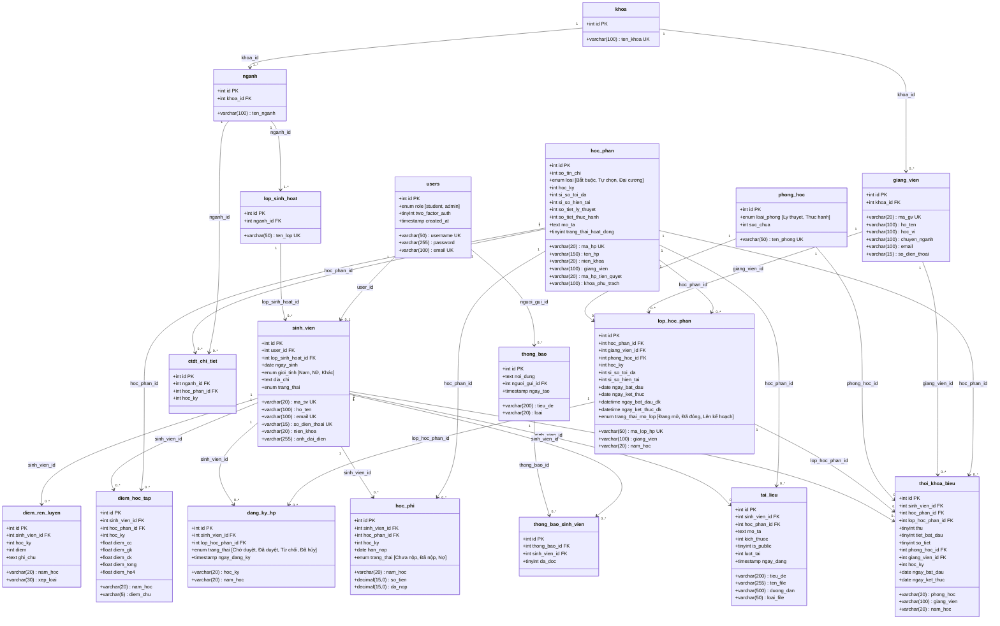

# BÁO CÁO PHÂN TÍCH & THIẾT KẾ HỆ THỐNG
## Hệ thống Quản lý Sinh viên — Đại học Quy Nhơn (QNU SMS)

---

## III. BIỂU ĐỒ LỚP DATABASE (18 Bảng)

### 3.1. Danh sách 18 bảng dữ liệu

| STT | Tên bảng | Mô tả chức năng |
|:---:|:---|:---|
| 1 | `users` | Tài khoản đăng nhập (Admin / Sinh viên) |
| 2 | `sinh_vien` | Thông tin hồ sơ sinh viên |
| 3 | `khoa` | Danh mục các Khoa trong trường |
| 4 | `nganh` | Danh mục Ngành học thuộc Khoa |
| 5 | `lop_sinh_hoat` | Lớp sinh hoạt (lớp hành chính) |
| 6 | `hoc_phan` | Danh mục Học phần (môn học) |
| 7 | `ctdt_chi_tiet` | Chi tiết Chương trình đào tạo theo Ngành |
| 8 | `lop_hoc_phan` | Lớp học phần mở đăng ký từng kỳ |
| 9 | `dang_ky_hp` | Đăng ký học phần của sinh viên |
| 10 | `diem_hoc_tap` | Bảng điểm học tập (CC, GK, CK, Tổng) |
| 11 | `diem_ren_luyen` | Điểm rèn luyện theo từng kỳ |
| 12 | `hoc_phi` | Thông tin học phí và trạng thái nộp |
| 13 | `thoi_khoa_bieu` | Thời khóa biểu sinh viên |
| 14 | `tai_lieu` | Tài liệu học tập chia sẻ |
| 15 | `thong_bao` | Thông báo hệ thống |
| 16 | `thong_bao_sinh_vien` | Bảng trung gian gửi thông báo đến sinh viên |
| 17 | `giang_vien` | Thông tin giảng viên (mã GV, học vị, chuyên ngành) |
| 18 | `phong_hoc` | Danh mục phòng học (loại phòng, sức chứa) |

### 3.2. Biểu đồ lớp Database (Class Diagram)



### 3.3. Chi tiết mối quan hệ giữa các bảng

| STT | Bảng cha | Bảng con | Khóa ngoại | Quan hệ | Mô tả |
|:---:|:---|:---|:---|:---:|:---|
| 1 | `users` | `sinh_vien` | `user_id` | 1:1 | Mỗi tài khoản student liên kết 1 sinh viên |
| 2 | `users` | `thong_bao` | `nguoi_gui_id` | 1:N | Admin gửi nhiều thông báo |
| 3 | `khoa` | `nganh` | `khoa_id` | 1:N | Mỗi khoa có nhiều ngành |
| 4 | `nganh` | `lop_sinh_hoat` | `nganh_id` | 1:N | Mỗi ngành có nhiều lớp sinh hoạt |
| 5 | `nganh` | `ctdt_chi_tiet` | `nganh_id` | 1:N | Mỗi ngành có chương trình đào tạo riêng |
| 6 | `lop_sinh_hoat` | `sinh_vien` | `lop_sinh_hoat_id` | 1:N | Mỗi lớp có nhiều sinh viên |
| 7 | `hoc_phan` | `ctdt_chi_tiet` | `hoc_phan_id` | 1:N | Học phần thuộc nhiều CTĐT |
| 8 | `hoc_phan` | `lop_hoc_phan` | `hoc_phan_id` | 1:N | Mỗi học phần mở nhiều lớp học phần |
| 9 | `hoc_phan` | `diem_hoc_tap` | `hoc_phan_id` | 1:N | Điểm theo từng học phần |
| 10 | `hoc_phan` | `thoi_khoa_bieu` | `hoc_phan_id` | 1:N | Lịch học theo học phần |
| 11 | `hoc_phan` | `tai_lieu` | `hoc_phan_id` | 1:N | Tài liệu gắn với học phần |
| 12 | `hoc_phan` | `hoc_phi` | `hoc_phan_id` | 1:N | Học phí theo học phần |
| 13 | `lop_hoc_phan` | `dang_ky_hp` | `lop_hoc_phan_id` | 1:N | Sinh viên đăng ký vào lớp học phần |
| 14 | `lop_hoc_phan` | `thoi_khoa_bieu` | `lop_hoc_phan_id` | 1:N | Lịch học theo lớp học phần |
| 15 | `sinh_vien` | `dang_ky_hp` | `sinh_vien_id` | 1:N | SV đăng ký nhiều lớp HP |
| 16 | `sinh_vien` | `diem_hoc_tap` | `sinh_vien_id` | 1:N | SV có nhiều bản ghi điểm |
| 17 | `sinh_vien` | `diem_ren_luyen` | `sinh_vien_id` | 1:N | SV có điểm RL nhiều kỳ |
| 18 | `sinh_vien` | `hoc_phi` | `sinh_vien_id` | 1:N | SV có nhiều khoản học phí |
| 19 | `sinh_vien` | `thoi_khoa_bieu` | `sinh_vien_id` | 1:N | SV có nhiều bản ghi TKB |
| 20 | `sinh_vien` | `tai_lieu` | `sinh_vien_id` | 1:N | SV chia sẻ nhiều tài liệu |
| 21 | `sinh_vien` | `thong_bao_sinh_vien` | `sinh_vien_id` | 1:N | SV nhận nhiều thông báo |
| 22 | `thong_bao` | `thong_bao_sinh_vien` | `thong_bao_id` | 1:N | 1 thông báo gửi nhiều SV |
| 23 | `khoa` | `giang_vien` | `khoa_id` | 1:N | Mỗi khoa có nhiều giảng viên |
| 24 | `giang_vien` | `lop_hoc_phan` | `giang_vien_id` | 1:N | GV phụ trách nhiều lớp HP |
| 25 | `giang_vien` | `thoi_khoa_bieu` | `giang_vien_id` | 1:N | GV có nhiều bản ghi TKB |
| 26 | `phong_hoc` | `lop_hoc_phan` | `phong_hoc_id` | 1:N | Phòng được dùng cho nhiều lớp HP |
| 27 | `phong_hoc` | `thoi_khoa_bieu` | `phong_hoc_id` | 1:N | Phòng có nhiều bản ghi TKB |

> [!NOTE]
> Bảng `thong_bao_sinh_vien` là **bảng trung gian** (junction table) thực hiện mối quan hệ **nhiều-nhiều (N:M)** giữa `thong_bao` và `sinh_vien`, cho phép gửi 1 thông báo đến nhiều sinh viên và 1 sinh viên nhận nhiều thông báo, đồng thời theo dõi trạng thái đã đọc (`da_doc`).

---

## IV. GIAO DIỆN CỦA HỆ THỐNG

### 4.1. Các trang giao diện chính

#### A. Phân hệ Xác thực (Authentication)

| STT | Tên trang | Đường dẫn | Mô tả |
|:---:|:---|:---|:---|
| 1 | Đăng nhập | `/auth/login` | Form đăng nhập với username/password |
| 2 | Xác thực OTP | `/auth/otp` | Nhập mã OTP gửi qua email |
| 3 | Quên mật khẩu | `/auth/forgot-password` | Nhập email để nhận mã passcode |
| 4 | Xác minh Passcode | `/auth/verify-passcode` | Nhập mã xác minh từ email |
| 5 | Đặt lại mật khẩu | `/auth/reset-password` | Form nhập mật khẩu mới |

#### B. Phân hệ Sinh viên (Student Portal)

| STT | Tên trang | Đường dẫn | Mô tả |
|:---:|:---|:---|:---|
| 1 | Bảng điều khiển | `/student/dashboard` | Tổng quan thông tin SV: TKB hôm nay, thống kê nhanh |
| 2 | Hồ sơ cá nhân | `/student/ho-so` | Xem thông tin cá nhân chi tiết |
| 3 | Cập nhật hồ sơ | `/student/cap-nhat` | Sửa thông tin liên lạc, đổi mật khẩu, upload ảnh |
| 4 | Chương trình đào tạo | `/student/chuong-trinh` | Xem CTĐT theo ngành, tiến độ hoàn thành |
| 5 | Đăng ký học phần | `/student/dang-ky-hoc-phan` | Đăng ký/hủy lớp HP, xem lớp HP đang mở |
| 6 | Thời khóa biểu | `/student/thoi-khoa-bieu` | Lịch học trực quan theo tuần/bảng |
| 7 | Điểm học tập | `/student/diem-hoc-tap` | Bảng điểm chi tiết, GPA tích lũy |
| 8 | Điểm rèn luyện | `/student/diem-ren-luyen` | Điểm RL và xếp loại theo kỳ |
| 9 | Tiến độ học tập | `/student/tien-do` | Biểu đồ tiến độ tín chỉ, GPA, mục tiêu |
| 10 | Học phí | `/student/hoc-phi` | Tra cứu công nợ, thanh toán online |
| 11 | Tài liệu học tập | `/student/tai-lieu` | Kho tài liệu chia sẻ, đăng tải, tìm kiếm |
| 12 | Thông báo | `/student/thong-bao` | Nhận và đọc thông báo từ nhà trường |

#### C. Phân hệ Quản trị viên (Admin Panel)

| STT | Tên trang | Đường dẫn | Mô tả |
|:---:|:---|:---|:---|
| 1 | Dashboard | `/admin/dashboard` | Thống kê tổng quan hệ thống |
| 2 | Quản lý Sinh viên | `/admin/sinh-vien` | CRUD sinh viên, import Excel |
| 3 | Quản lý Học phần | `/admin/hoc-phan` | CRUD học phần, sao chép CTĐT |
| 4 | Quản lý Lớp HP | `/admin/lop-hoc-phan` | Mở/đóng lớp HP, tối ưu hàng loạt |
| 5 | Quản lý Khoa | `/admin/khoa` | CRUD danh mục Khoa |
| 6 | Quản lý Ngành | `/admin/nganh` | CRUD danh mục Ngành |
| 7 | Quản lý Lớp SH | `/admin/lop-sinh-hoat` | CRUD lớp sinh hoạt |
| 8 | Điểm Học tập | `/admin/diem/hoc-tap` | Nhập/sửa điểm, import Excel |
| 9 | Điểm Rèn luyện | `/admin/diem/ren-luyen` | Nhập/sửa điểm RL, import Excel |
| 10 | Thời khóa biểu | `/admin/thoi-khoa-bieu` | CRUD TKB, tối ưu tự động |
| 11 | Quản lý Users | `/admin/users` | CRUD tài khoản người dùng |
| 12 | Tài liệu | `/admin/tai-lieu` | Quản lý tài liệu học tập |
| 13 | Học phí | `/admin/hoc-phi` | Quản lý, xác nhận, tính tự động |
| 14 | Sao lưu dữ liệu | `/admin/data-sync` | Export/Import toàn bộ CSDL |
| 15 | Thông báo | `/admin/thong-bao` | Soạn/gửi thông báo đến SV |
| 16 | Quản lý Giảng viên | `/admin/giang-vien` | CRUD giảng viên, phân khoa |
| 17 | Quản lý Phòng học | `/admin/phong-hoc` | CRUD phòng học, phân loại phòng |

### 4.2. Gợi ý ảnh giao diện minh họa cần chụp

> [!TIP]
> Dưới đây là danh sách **25 ảnh giao diện minh họa** được gợi ý chụp theo thứ tự ưu tiên để đưa vào báo cáo. Nên chụp ở **trình duyệt Chrome**, chế độ **Desktop (1920x1080)**, có dữ liệu thực tế.

#### Nhóm 1: Xác thực & Bảo mật (4 ảnh)
| # | Ảnh | Tên file gợi ý | Mô tả nội dung cần chụp |
|:---:|:---|:---|:---|
| 1 | Trang Đăng nhập | `gd_dangnhap.png` | Form đăng nhập hoàn chỉnh với logo QNU |
| 2 | Trang OTP | `gd_otp.png` | Màn hình nhập mã OTP sau đăng nhập |
| 3 | Quên mật khẩu | `gd_quenmatkhau.png` | Form nhập email khôi phục |
| 4 | Đặt lại mật khẩu | `gd_datlaimatkhau.png` | Form nhập mật khẩu mới |

#### Nhóm 2: Sinh viên - Trang chính (8 ảnh)
| # | Ảnh | Tên file gợi ý | Mô tả nội dung cần chụp |
|:---:|:---|:---|:---|
| 5 | Dashboard SV | `gd_sv_dashboard.png` | Bảng điều khiển SV với TKB hôm nay, thống kê |
| 6 | Hồ sơ SV | `gd_sv_hoso.png` | Thông tin cá nhân chi tiết, ảnh đại diện |
| 7 | CTĐT | `gd_sv_ctdt.png` | Bảng chương trình đào tạo theo học kỳ |
| 8 | Đăng ký HP | `gd_sv_dangky.png` | Tab lớp HP đang mở đăng ký + nút đăng ký |
| 9 | TKB | `gd_sv_tkb.png` | Bảng thời khóa biểu theo tuần (grid) |
| 10 | Điểm học tập | `gd_sv_diemhoctap.png` | Bảng điểm chi tiết + GPA tích lũy |
| 11 | Tiến độ | `gd_sv_tiendo.png` | Biểu đồ tiến độ tín chỉ + GPA qua các kỳ |
| 12 | Học phí | `gd_sv_hocphi.png` | Bảng công nợ học phí + trạng thái |

#### Nhóm 3: Sinh viên - Chức năng phụ (4 ảnh)
| # | Ảnh | Tên file gợi ý | Mô tả nội dung cần chụp |
|:---:|:---|:---|:---|
| 13 | Điểm RL | `gd_sv_diemrl.png` | Bảng điểm rèn luyện theo kỳ |
| 14 | Tài liệu | `gd_sv_tailieu.png` | Kho tài liệu chia sẻ + nút đăng/tải |
| 15 | Thông báo | `gd_sv_thongbao.png` | Danh sách thông báo nhà trường |
| 16 | Cập nhật HS | `gd_sv_capnhat.png` | Form sửa thông tin, đổi mật khẩu |

#### Nhóm 4: Admin Panel (9 ảnh)
| # | Ảnh | Tên file gợi ý | Mô tả nội dung cần chụp |
|:---:|:---|:---|:---|
| 17 | Dashboard Admin | `gd_admin_dashboard.png` | Thống kê tổng quan, biểu đồ |
| 18 | QL Sinh viên | `gd_admin_sinhvien.png` | Danh sách SV + tìm kiếm, lọc |
| 19 | QL Học phần | `gd_admin_hocphan.png` | Bảng CRUD học phần + modal thêm |
| 20 | QL Lớp HP | `gd_admin_lophocphan.png` | Danh sách lớp HP mở, nút tối ưu |
| 21 | Nhập Điểm | `gd_admin_nhapdiem.png` | Form nhập điểm theo lớp, bảng điểm |
| 22 | TKB Optimize | `gd_admin_tkb_optimize.png` | Trang tối ưu TKB tự động |
| 23 | QL Học phí | `gd_admin_hocphi.png` | Bảng quản lý học phí, xác nhận nộp |
| 24 | Gửi Thông báo | `gd_admin_thongbao.png` | Form soạn + gửi thông báo |
| 25 | Sao lưu DL | `gd_admin_saoluu.png` | Trang Data Sync (Export/Import) |

---

## V. CÀI ĐẶT CHƯƠNG TRÌNH

### 5.1. Công nghệ sử dụng

| Thành phần | Công nghệ sử dụng | Ghi chú |
|:---|:---|:---|
| **Ngôn ngữ Backend** | PHP ≥ 7.4 | Lập trình hướng đối tượng, tuân thủ PSR-4 |
| **Kiến trúc** | MVC (Model–View–Controller) thuần | Tự xây dựng Router, Controller base, không dùng framework |
| **Cơ sở dữ liệu** | MySQL ≥ 5.7 / MariaDB ≥ 10.3 | 16 bảng, quan hệ khóa ngoại đầy đủ |
| **Kết nối CSDL** | PDO (PHP Data Objects) | Prepared Statements chống SQL Injection |
| **Web Server** | Apache (XAMPP) | URL Rewrite qua `.htaccess` |
| **Frontend - HTML** | HTML5 | Semantic tags, SEO-friendly |
| **Frontend - CSS** | Vanilla CSS (custom) | 2 file chính: `style.css`, `student.css` |
| **Frontend - JS** | JavaScript ES6+ | AJAX, DOM manipulation |
| **Thư viện Popup** | SweetAlert2 (CDN) | Thay thế alert/confirm native |
| **Biểu đồ** | Chart.js (CDN) | Biểu đồ tiến độ, GPA, thống kê |
| **Font chữ** | Google Fonts — Inter | Typography hiện đại |
| **Icon** | Font Awesome 6 (CDN) | Icon vector cho menu, button |
| **Mã hóa mật khẩu** | Bcrypt (`password_hash`) | Tiêu chuẩn công nghiệp |
| **Xác thực 2 lớp** | OTP qua Email (PHPMailer) | Mã OTP 6 số, hết hạn sau 5 phút |
| **Quản lý phiên** | PHP Session + `session_regenerate_id` | Chống Session Hijacking |
| **Chống XSS** | `htmlspecialchars()` (helper `e()`) | Escape output toàn bộ view |
| **Quản lý mã nguồn** | Git + GitHub | Version control |

### 5.2. Cấu trúc thư mục / mã nguồn

```text
qnu-student-management/
│
├── index.php                          # Front Controller — điểm vào duy nhất xử lý routing
├── .htaccess                          # Apache Rewrite Engine cho URL thân thiện
├── .gitignore                         # Loại trừ file khi push Git
│
├── config/                            # ═══ CẤU HÌNH HỆ THỐNG ═══
│   ├── constants.php                  # Hằng số: BASE_URL, ROOT path
│   ├── database.php                   # Cấu hình kết nối PDO (host, user, pass, dbname)
│   ├── mail.php                       # Cấu hình PHPMailer (SMTP, credentials)
│   ├── schema.sql                     # Script khởi tạo cấu trúc 18 bảng
│   └── seed_qnu_data.sql             # Dữ liệu mẫu ban đầu
│
├── app/                               # ═══ MVC SOURCE CODE CHÍNH ═══
│   ├── Core/                          # Lớp cốt lõi tự xây dựng
│   │   ├── Controller.php             # Base Controller (render view, truyền data)
│   │   ├── Database.php               # Database Singleton (PDO wrapper)
│   │   └── Router.php                 # Custom URL Routing Engine
│   │
│   ├── Controllers/                   # Bộ điều khiển (xử lý request → response)
│   │   ├── AuthController.php         # Đăng nhập, OTP, quên/đổi mật khẩu
│   │   ├── CourseController.php       # CTĐT, điểm, TKB, đăng ký HP (SV)
│   │   ├── DocumentController.php     # Upload/download tài liệu (SV)
│   │   ├── StudentController.php      # Hồ sơ, tiến độ, RL, học phí, thông báo (SV)
│   │   └── Admin/                     # === Admin Controllers ===
│   │       ├── DashboardController.php    # Trang dashboard admin
│   │       ├── StudentController.php      # CRUD sinh viên, import Excel
│   │       ├── CourseController.php        # CRUD học phần, sao chép CTĐT
│   │       ├── ClassController.php        # CRUD lớp học phần
│   │       ├── ClassStudentController.php # CRUD lớp sinh hoạt
│   │       ├── FacultyController.php      # CRUD Khoa
│   │       ├── MajorController.php        # CRUD Ngành
│   │       ├── GradeController.php        # Nhập điểm HT + RL, import Excel
│   │       ├── ScheduleController.php     # CRUD TKB, thuật toán tối ưu
│   │       ├── UserController.php         # CRUD tài khoản users
│   │       ├── DocumentController.php     # CRUD tài liệu
│   │       ├── TuitionController.php      # Quản lý học phí, tính tự động
│   │       ├── DataSyncController.php     # Sao lưu/phục hồi CSDL
│   │       ├── NotificationController.php # Soạn/gửi thông báo
│   │       ├── GiangVienController.php    # CRUD giảng viên
│   │       └── PhongHocController.php     # CRUD phòng học
│   │
│   ├── Models/                        # Lớp truy vấn dữ liệu
│   │   ├── StudentModel.php           # Query SV: hồ sơ, GPA, tiến độ
│   │   ├── CourseModel.php            # Query: CTĐT, đăng ký HP, TKB, điểm
│   │   ├── DocumentModel.php          # Query: tài liệu chia sẻ
│   │   ├── NotificationModel.php      # Query: thông báo + cảnh báo
│   │   ├── UserModel.php             # Query: xác thực user
│   │   ├── FacultyModel.php          # Query: danh mục Khoa
│   │   ├── MajorModel.php            # Query: danh mục Ngành
│   │   ├── ClassStudentModel.php     # Query: lớp sinh hoạt
│   │   ├── AdminModel.php            # Query: dashboard admin
│   │   ├── AdminStudentModel.php     # Query: CRUD SV (admin)
│   │   ├── AdminCourseModel.php      # Query: CRUD HP + lớp HP (admin)
│   │   ├── AdminGradeModel.php       # Query: nhập/sửa điểm (admin)
│   │   ├── AdminScheduleModel.php    # Query: TKB + thuật toán (admin)
│   │   ├── AdminTuitionModel.php     # Query: học phí (admin)
│   │   ├── AdminDocumentModel.php    # Query: tài liệu (admin)
│   │   ├── AdminUserModel.php        # Query: CRUD users (admin)
│   │   ├── GiangVienModel.php       # Query: CRUD giảng viên
│   │   └── PhongHocModel.php        # Query: CRUD phòng học
│   │
│   └── Views/                         # Giao diện hiển thị (PHP + HTML)
│       ├── auth/                      # 5 trang: login, otp, forgot, verify, reset
│       ├── student/                   # 12 trang: dashboard, profile, grades...
│       └── admin/                     # 15 thư mục + 1 dashboard.php
│           ├── class/                 # Quản lý lớp học phần
│           ├── class_student/         # Quản lý lớp sinh hoạt
│           ├── course/                # Quản lý học phần
│           ├── data_sync/             # Sao lưu/phục hồi
│           ├── document/              # Quản lý tài liệu
│           ├── faculty/               # Quản lý Khoa
│           ├── giang_vien/            # Quản lý Giảng viên
│           ├── grade/                 # Nhập/quản lý điểm
│           ├── major/                 # Quản lý Ngành
│           ├── notifications/         # Quản lý thông báo
│           ├── phong_hoc/             # Quản lý Phòng học
│           ├── schedule/              # Quản lý TKB
│           ├── student/               # Quản lý sinh viên
│           ├── tuition/               # Quản lý học phí
│           └── users/                 # Quản lý tài khoản
│
├── includes/                          # ═══ SHARED LAYOUTS & HELPERS ═══
│   ├── header.php                     # Head HTML, link CSS, meta tags
│   ├── footer.php                     # Script JS chung, đóng thẻ body
│   ├── navbar_student.php             # Sidebar navigation cho SV
│   ├── session.php                    # Session management, role-based access
│   ├── admin/                         # Header/footer/navbar riêng cho Admin
│   └── vendor/                        # Thư viện bên thứ 3 (PHPMailer)
│
├── assets/                            # ═══ TÀI NGUYÊN TĨNH ═══
│   ├── css/
│   │   ├── style.css                  # Theme chính (auth, admin layout)
│   │   └── student.css                # Theme riêng sinh viên (sidebar, cards)
│   ├── js/
│   │   ├── main.js                    # Logic JS chính (SweetAlert2, AJAX)
│   │   └── validation.js             # Validate form client-side
│   └── img/                           # Logo, ảnh mặc định
│
├── database/                          # ═══ MIGRATION & SEEDER ═══
│   ├── migrate_khoa_nganh_lop.php     # Migration: tạo bảng khoa, ngành, lớp SH
│   └── seeder.php                     # Seeder tích hợp: 550+ SV, 107 HP, 64+ tài liệu, 20 GV, 18 PH
│
├── uploads/                           # Thư mục chứa file upload (ảnh, tài liệu)
├── storage/                           # Log hệ thống, file tạm
└── tools/                             # Script tiện ích (update grades, make unique)
```

### 5.3. Chức năng đã cài đặt

#### A. Phân hệ Xác thực & Bảo mật

| STT | Chức năng | Tình trạng | Minh chứng / Ghi chú |
|:---:|:---|:---:|:---|
| 1 | Đăng nhập bằng username/password | ✅ Hoàn thành | `AuthController@processLogin` — Bcrypt verify |
| 2 | Xác thực 2 lớp (OTP qua Email) | ✅ Hoàn thành | `AuthController@processOtp` — PHPMailer SMTP |
| 3 | Quên mật khẩu (gửi passcode email) | ✅ Hoàn thành | `AuthController@processForgotPassword` |
| 4 | Đặt lại mật khẩu | ✅ Hoàn thành | `AuthController@processResetPassword` |
| 5 | Phân quyền Admin / Sinh viên | ✅ Hoàn thành | `session.php` — `requireLogin()`, `requireAdmin()` |
| 6 | Chống SQL Injection (PDO) | ✅ Hoàn thành | `Database.php` — Prepared Statements toàn bộ |
| 7 | Chống XSS | ✅ Hoàn thành | Helper `e()` — `htmlspecialchars()` ở mọi view |
| 8 | Chống Session Hijacking | ✅ Hoàn thành | `session_regenerate_id(true)` sau login |

#### B. Phân hệ Sinh viên

| STT | Chức năng | Tình trạng | Minh chứng / Ghi chú |
|:---:|:---|:---:|:---|
| 1 | Dashboard tổng quan | ✅ Hoàn thành | Hiển thị TKB hôm nay, GPA, thông báo mới |
| 2 | Xem hồ sơ cá nhân | ✅ Hoàn thành | `StudentController@profile` |
| 3 | Cập nhật hồ sơ + Upload ảnh đại diện | ✅ Hoàn thành | `StudentController@processUpdateProfile` |
| 4 | Đổi mật khẩu | ✅ Hoàn thành | `StudentController@processChangePassword` |
| 5 | Xem Chương trình đào tạo | ✅ Hoàn thành | Theo ngành, phân loại theo học kỳ |
| 6 | Đăng ký học phần (kiểm tra ràng buộc) | ✅ Hoàn thành | Kiểm tra tiên quyết, trùng lịch, sĩ số |
| 7 | Hủy đăng ký học phần | ✅ Hoàn thành | Cập nhật trạng thái "Đã hủy" |
| 8 | Xem thời khóa biểu theo tuần | ✅ Hoàn thành | Giao diện grid lịch trực quan |
| 9 | Xem bảng điểm học tập | ✅ Hoàn thành | Điểm CC, GK, CK, Tổng, chữ, hệ 4 |
| 10 | Xem GPA tích lũy + Biểu đồ | ✅ Hoàn thành | Chart.js vẽ biểu đồ GPA qua các kỳ |
| 11 | Theo dõi tiến độ tích lũy tín chỉ | ✅ Hoàn thành | Biểu đồ tròn, progress bar |
| 12 | Đặt mục tiêu GPA | ✅ Hoàn thành | `StudentController@saveGpaTarget` |
| 13 | Xem điểm rèn luyện | ✅ Hoàn thành | Theo từng kỳ + xếp loại |
| 14 | Tra cứu học phí | ✅ Hoàn thành | Chi tiết từng kỳ, trạng thái nộp |
| 15 | Thanh toán học phí (mô phỏng) | ✅ Hoàn thành | `StudentController@payTuition` |
| 16 | Đăng tài liệu chia sẻ | ✅ Hoàn thành | Upload file + metadata |
| 17 | Tìm kiếm & Tải tài liệu | ✅ Hoàn thành | Lọc theo học phần, tìm kiếm text |
| 18 | Xem thông báo nhà trường | ✅ Hoàn thành | Đánh dấu đã đọc |

#### C. Phân hệ Quản trị viên (Admin)

| STT | Chức năng | Tình trạng | Minh chứng / Ghi chú |
|:---:|:---|:---:|:---|
| 1 | Dashboard thống kê | ✅ Hoàn thành | Biểu đồ: SV, HP, tỷ lệ học phí |
| 2 | CRUD Sinh viên | ✅ Hoàn thành | Thêm/Sửa/Xóa + Import Excel template |
| 3 | CRUD Học phần | ✅ Hoàn thành | Modal form + sao chép CTĐT nhanh |
| 4 | CRUD Lớp Học Phần | ✅ Hoàn thành | Mở/đóng lớp HP, batch open |
| 5 | Tối ưu hóa Lớp HP | ✅ Hoàn thành | `ClassController@optimize` |
| 6 | CRUD Khoa | ✅ Hoàn thành | `FacultyController` |
| 7 | CRUD Ngành | ✅ Hoàn thành | `MajorController` |
| 8 | CRUD Lớp Sinh hoạt | ✅ Hoàn thành | `ClassStudentController` |
| 9 | Nhập Điểm Học tập | ✅ Hoàn thành | Nhập theo lớp, import Excel |
| 10 | Nhập Điểm Rèn luyện | ✅ Hoàn thành | Nhập theo lớp, import Excel |
| 11 | Export Template Excel (Điểm) | ✅ Hoàn thành | Download file template CSV |
| 12 | CRUD Thời khóa biểu | ✅ Hoàn thành | Thêm/Sửa/Xóa bản ghi TKB |
| 13 | Tối ưu TKB tự động (Optimizer) | ✅ Hoàn thành | Thuật toán phân bổ lịch thông minh |
| 14 | CRUD Tài khoản Users | ✅ Hoàn thành | Thêm/Sửa/Xóa, phân quyền |
| 15 | CRUD Tài liệu | ✅ Hoàn thành | Upload/Sửa/Xóa tài liệu |
| 16 | Quản lý Học phí | ✅ Hoàn thành | Cập nhật, xác nhận, tính tự động |
| 17 | Tính Học phí tự động | ✅ Hoàn thành | `TuitionController@autoCalculate` |
| 18 | Báo cáo Học phí | ✅ Hoàn thành | `TuitionController@report` |
| 19 | Sao lưu CSDL (Export) | ✅ Hoàn thành | Xuất SQL file một click |
| 20 | Phục hồi CSDL (Import) | ✅ Hoàn thành | Import SQL file + xử lý nền |
| 21 | Soạn & Gửi Thông báo | ✅ Hoàn thành | Gửi cho: Tất cả, Khoa, Lớp, SV cá nhân |
| 22 | Cảnh báo học vụ | ✅ Hoàn thành | SV cảnh báo điểm, nợ HP, RL yếu |
| 23 | CRUD Giảng viên | ✅ Hoàn thành | `GiangVienController` — Thêm/Sửa/Xóa, phân khoa |
| 24 | CRUD Phòng học | ✅ Hoàn thành | `PhongHocController` — Thêm/Sửa/Xóa, phân loại phòng |
| 25 | Sinh lớp & Xếp lịch tự động | ✅ Hoàn thành | Thuật toán RAM-based tự động tạo lớp HP + xếp lịch tránh trùng |
| 26 | Cảnh báo vận hành lớp HP | ✅ Hoàn thành | Hiển thị lỗi thiếu GV/phòng/sĩ số, gợi ý sửa + link trực tiếp |

---

## VI. KIỂM THỬ, KẾT LUẬN VÀ PHỤ LỤC

### 6.1. Kiểm thử chức năng

#### A. Kiểm thử chức năng Xác thực

| # | Trường hợp kiểm thử | Đầu vào | Kết quả mong đợi | Kết quả thực tế | Đạt/Không |
|:---:|:---|:---|:---|:---|:---:|
| TC-01 | Đăng nhập thành công (Admin) | username: `admin`, pass: `password` | Chuyển đến Dashboard Admin | Đúng như mong đợi | ✅ |
| TC-02 | Đăng nhập thành công (SV) | username: `4751190039`, pass: `Student@123` | Gửi OTP qua email → trang OTP | Đúng như mong đợi | ✅ |
| TC-03 | Đăng nhập sai mật khẩu | username: `admin`, pass: `sai123` | Hiển thị lỗi "Sai mật khẩu" | Đúng như mong đợi | ✅ |
| TC-04 | Đăng nhập username không tồn tại | username: `abc`, pass: `123` | Hiển thị lỗi "Tài khoản không tồn tại" | Đúng như mong đợi | ✅ |
| TC-05 | Xác thực OTP đúng | Mã OTP hợp lệ 6 số | Đăng nhập thành công → Dashboard SV | Đúng như mong đợi | ✅ |
| TC-06 | Xác thực OTP sai | Mã OTP sai | Hiển thị lỗi "Mã OTP không đúng" | Đúng như mong đợi | ✅ |
| TC-07 | Quên mật khẩu | Email SV hợp lệ | Gửi passcode về email | Đúng như mong đợi | ✅ |
| TC-08 | Truy cập trang Admin khi chưa login | URL `/admin/dashboard` trực tiếp | Redirect về trang đăng nhập | Đúng như mong đợi | ✅ |

#### B. Kiểm thử chức năng Sinh viên

| # | Trường hợp kiểm thử | Đầu vào | Kết quả mong đợi | Kết quả thực tế | Đạt/Không |
|:---:|:---|:---|:---|:---|:---:|
| TC-09 | Xem hồ sơ cá nhân | Truy cập `/student/ho-so` | Hiển thị đầy đủ thông tin SV | Đúng như mong đợi | ✅ |
| TC-10 | Cập nhật SĐT | SĐT mới hợp lệ | Cập nhật thành công | Đúng như mong đợi | ✅ |
| TC-11 | Đổi mật khẩu đúng | MK cũ đúng, MK mới hợp lệ | Đổi MK thành công | Đúng như mong đợi | ✅ |
| TC-12 | Đổi MK — nhập sai MK cũ | MK cũ sai | Hiển thị lỗi "Mật khẩu cũ không đúng" | Đúng như mong đợi | ✅ |
| TC-13 | Đăng ký HP hợp lệ | Chọn lớp HP đang mở, đủ điều kiện | Đăng ký thành công | Đúng như mong đợi | ✅ |
| TC-14 | Đăng ký HP thiếu tiên quyết | Chọn HP có điều kiện tiên quyết chưa hoàn thành | Hiển thị cảnh báo "Chưa hoàn thành môn tiên quyết" | Đúng như mong đợi | ✅ |
| TC-15 | Đăng ký HP khi lớp đầy | Lớp HP đã đạt sĩ số tối đa | Hiển thị lỗi "Lớp đã đầy" | Đúng như mong đợi | ✅ |
| TC-16 | Hủy đăng ký HP | Nhấn nút hủy trên HP đã đăng ký | Hủy thành công, cập nhật sĩ số | Đúng như mong đợi | ✅ |
| TC-17 | Xem bảng điểm | Truy cập `/student/diem-hoc-tap` | Hiển thị đầy đủ điểm CC, GK, CK, tổng | Đúng như mong đợi | ✅ |
| TC-18 | Xem TKB | Truy cập `/student/thoi-khoa-bieu` | Hiển thị lịch học theo tuần | Đúng như mong đợi | ✅ |
| TC-19 | Upload tài liệu | File PDF ≤ 10MB | Upload thành công, hiển thị trong kho | Đúng như mong đợi | ✅ |
| TC-20 | Tải xuống tài liệu | Nhấn nút tải trên tài liệu | Download file thành công | Đúng như mong đợi | ✅ |

#### C. Kiểm thử chức năng Admin

| # | Trường hợp kiểm thử | Đầu vào | Kết quả mong đợi | Kết quả thực tế | Đạt/Không |
|:---:|:---|:---|:---|:---|:---:|
| TC-21 | Thêm sinh viên mới | Điền form đầy đủ | Tạo SV + tài khoản user tự động | Đúng như mong đợi | ✅ |
| TC-22 | Import SV từ Excel | File CSV template | Import đúng số lượng, hiển thị kết quả | Đúng như mong đợi | ✅ |
| TC-23 | Xóa sinh viên | Chọn SV → Xóa | Xóa SV + dữ liệu liên quan (CASCADE) | Đúng như mong đợi | ✅ |
| TC-24 | Thêm học phần mới | Điền mã HP, tên, tín chỉ | Tạo HP thành công | Đúng như mong đợi | ✅ |
| TC-25 | Mở lớp HP đăng ký | Chọn HP → Mở lớp | Tạo lớp HP, sinh viên thấy trong đăng ký | Đúng như mong đợi | ✅ |
| TC-26 | Nhập điểm cho lớp | Chọn lớp → nhập CC, GK, CK | Tự động tính tổng, chữ, hệ 4 | Đúng như mong đợi | ✅ |
| TC-27 | Tối ưu TKB tự động | Chọn HK + năm học → Tối ưu | Phân bổ lịch tránh trùng | Đúng như mong đợi | ✅ |
| TC-28 | Tính học phí tự động | Chọn HK → Tính | Tính số tiền theo tín chỉ đã ĐK | Đúng như mong đợi | ✅ |
| TC-29 | Gửi thông báo cho tất cả SV | Chọn "Tất cả" → Soạn → Gửi | Tất cả SV nhận thông báo | Đúng như mong đợi | ✅ |
| TC-30 | Sao lưu CSDL | Nhấn nút Export | Tải về file SQL đầy đủ | Đúng như mong đợi | ✅ |

#### D. Kiểm thử phi chức năng

| # | Loại kiểm thử | Nội dung | Kết quả |
|:---:|:---|:---|:---|
| TC-31 | **Bảo mật SQL Injection** | Nhập `' OR 1=1 --` vào form đăng nhập | ✅ Không bị tấn công — PDO Prepared Statement |
| TC-32 | **Bảo mật XSS** | Nhập `<script>alert('XSS')</script>` vào form | ✅ Bị escape an toàn — `htmlspecialchars()` |
| TC-33 | **Phân quyền** | SV truy cập URL admin | ✅ Bị redirect về trang đăng nhập |
| TC-34 | **Responsive UI** | Mở trên Mobile (375px) | ✅ Sidebar thu gọn, bảng cuộn ngang |
| TC-35 | **Hiệu suất** | Tải trang Dashboard (550+ SV) | ✅ Thời gian tải < 2 giây |

### 6.2. Kết quả đạt được

#### A. Kết quả về mặt chức năng

- ✅ **Hoàn thành 52/52 chức năng** đã lên kế hoạch (100%), bao gồm:
  - 8 chức năng bảo mật & xác thực
  - 18 chức năng phía sinh viên
  - 26 chức năng phía quản trị viên
- ✅ **35/35 test cases** đều pass thành công
- ✅ Hệ thống hoạt động ổn định với **550+ sinh viên**, **107 học phần**, **20 giảng viên**, **18 phòng học**, **51 ngành**, **12 khoa**

#### B. Kết quả về mặt kỹ thuật

| Tiêu chí | Kết quả |
|:---|:---|
| Kiến trúc MVC | ✅ Tách biệt hoàn toàn Model–View–Controller |
| Bảo mật | ✅ Bcrypt + PDO + XSS Protection + 2FA/OTP |
| Cơ sở dữ liệu | ✅ 18 bảng, quan hệ khóa ngoại đầy đủ, chuẩn hóa 3NF |
| Giao diện | ✅ Responsive, hiện đại, SweetAlert2, Chart.js |
| Thuật toán | ✅ Tối ưu TKB tự động RAM-based tránh trùng lịch |
| Quản lý mã nguồn | ✅ Git + GitHub, commit history rõ ràng |

#### C. Kết quả về mặt dữ liệu thực tế

| Dữ liệu | Số lượng |
|:---|:---|
| Khoa | 12 khoa thực tế ĐH Quy Nhơn |
| Ngành | 51 ngành |
| Lớp sinh hoạt | 51 lớp (K47) |
| Sinh viên | 550+ sinh viên (50 SV KTPM thực tế + 500 SV các ngành) |
| Học phần | 107 học phần (đại cương + chuyên ngành) |
| CTĐT | Đầy đủ 9 học kỳ ngành KTPM thực tế |
| Giảng viên | 20 giảng viên |
| Phòng học | 18 phòng (lý thuyết + thực hành) |
| Điểm học tập | 3 kỳ điểm cho mỗi SV |
| Tài liệu | 64+ tài liệu chia sẻ mẫu |

### 6.3. Hạn chế và hướng phát triển

#### A. Hạn chế hiện tại

| STT | Hạn chế | Mức độ | Giải thích |
|:---:|:---|:---:|:---|
| 1 | Thanh toán học phí chỉ ở mức mô phỏng | Trung bình | Chưa tích hợp cổng thanh toán thực (VNPay, MoMo) |
| 2 | Chưa có REST API | Trung bình | Chưa hỗ trợ ứng dụng mobile native gọi API |
| 3 | Chưa xuất báo cáo PDF/Excel | Nhẹ | Chưa tích hợp thư viện export (TCPDF, PhpSpreadsheet) |
| 4 | Chưa có tính năng chat/forum | Nhẹ | Chưa có kênh trao đổi trực tiếp giữa SV-GV |

#### B. Hướng phát triển trong tương lai

| STT | Hướng phát triển | Mô tả | Ưu tiên |
|:---:|:---|:---|:---:|
| 1 | **Tích hợp cổng thanh toán** | Kết nối VNPay/MoMo/ZaloPay để nộp học phí trực tuyến | ⭐⭐⭐ |
| 2 | **Xây dựng REST API** | API chuẩn RESTful cho ứng dụng mobile và tích hợp bên thứ 3 | ⭐⭐⭐ |
| 3 | **Ứng dụng Mobile** | Phát triển app iOS/Android bằng React Native hoặc Flutter | ⭐⭐⭐ |
| 4 | **Xuất báo cáo PDF/Excel** | Tích hợp TCPDF/PhpSpreadsheet để xuất bảng điểm, TKB | ⭐⭐ |
| 5 | **Hệ thống chat/forum** | Trao đổi trực tiếp giữa SV và GV theo từng học phần | ⭐⭐ |
| 6 | **Thông báo Push/Email tự động** | Gửi nhắc nhở tự động: đăng ký HP, nợ học phí, lịch thi | ⭐⭐ |
| 7 | **Dark Mode** | Hỗ trợ giao diện tối cho trải nghiệm ban đêm | ⭐ |
| 8 | **Đa ngôn ngữ (i18n)** | Hỗ trợ Tiếng Việt / Tiếng Anh | ⭐ |

---

> [!IMPORTANT]
> Tài liệu này được tạo tự động dựa trên phân tích mã nguồn thực tế của dự án `qnu-student-management`. Mọi thông tin về bảng, chức năng, và cấu trúc đều được trích xuất trực tiếp từ codebase hiện tại.
